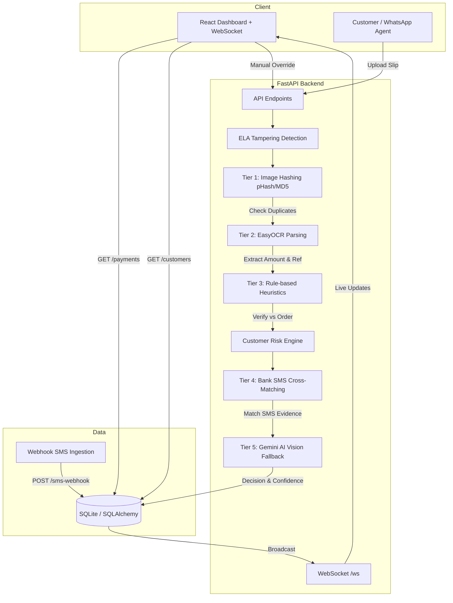

# 🏦 Automated Bank Payment Verification System

> A cost-optimized, multi-tiered AI verification pipeline that automates bank slip verifications, detects fraud using ELA (Error Level Analysis), and reduces human workload with real-time WebSocket dashboard.


---

## 📋 Table of Contents

- [Features](#-features)
- [Tech Stack](#-tech-stack)
- [Architecture](#-architecture)
- [Project Structure](#-project-structure)
- [Prerequisites](#-prerequisites)
- [Installation & Setup](#-installation--setup)
- [Running the Application](#-running-the-application)
- [API Endpoints](#-api-endpoints)
- [Cost Optimization](#-cost-optimization)
- [Limitations & Future Improvements](#-limitations--future-improvements)

---

## ✨ Features

### 🔍 ELA Tampering Detection (Photoshop Fraud Detector)
Uses **Error Level Analysis** — a digital forensics technique. When a JPEG is edited, the edited pixels have a different compression level. ELA amplifies this difference and creates a heatmap showing exactly **where** the image was tampered.
- ELA score badge: 🟢 green = clean, 🔴 red = suspicious (threshold > 40)

### 👤 Customer Risk Score & History Tracking
Tracks every customer's submission history. Repeat fraudsters get a higher **Risk Score** and future submissions are scrutinized more strictly.
- Risk levels: `LOW` → `MEDIUM` → `HIGH` → `BLACKLISTED`
- HIGH/BLACKLISTED customers auto-reduce confidence by 0.3

### 📡 Real-Time WebSocket Dashboard
Admin dashboard updates **live** when new payments arrive — no manual refresh needed.
- Toast notification + sound on new payment
- Slide-in animation for new submissions
- Live status updates on manual override

### 🤖 Multi-Tier AI Verification Pipeline
| Tier | Method | Cost |
|------|--------|------|
| Tier 1 | Image Hashing (pHash/MD5) — Duplicate Detection | Free |
| Tier 2 | EasyOCR — Text Extraction from Slips | Free |
| Tier 3 | Rule-based Heuristics — Amount & Reference Validation | Free |
| Tier 4 | Bank SMS Cross-Matching via Webhook | Free |
| Tier 5 | Gemini AI Vision — Fallback (only when needed) | ~$0 |

---

## 🛠️ Tech Stack

### Backend
| Technology | Purpose |
|-----------|---------|
| **Python 3.11+** | Core programming language |
| **FastAPI** | High-performance async web framework |
| **Uvicorn** | ASGI server for running FastAPI |
| **SQLAlchemy** | ORM for database operations |
| **SQLite** | Lightweight database (dev/prototype) |
| **EasyOCR** | Local OCR engine for text extraction from payment slips |
| **OpenCV** | Image processing for ELA tampering detection |
| **Pillow (PIL)** | Image manipulation and analysis |
| **ImageHash** | Perceptual hashing (pHash) for duplicate detection |
| **Google Generative AI (Gemini)** | AI Vision fallback for complex slip verification |
| **Pydantic** | Data validation and serialization |
| **python-dotenv** | Environment variable management |
| **httpx** | Async HTTP client |
| **pytest** | Testing framework |

### Frontend
| Technology | Purpose |
|-----------|---------|
| **React 19** | UI component library |
| **Vite 8** | Fast build tool and dev server |
| **TailwindCSS 4** | Utility-first CSS framework |
| **Axios** | HTTP client for API requests |
| **Lucide React** | Icon library |
| **WebSocket API** | Real-time live updates |

---

## 🏗️ Architecture



---

## 📁 Project Structure

```
bank-payment-verification/
├── backend/
│   ├── app/
│   │   ├── api/              # API route handlers
│   │   ├── core/             # Core configuration
│   │   ├── db/               # Database models & session
│   │   ├── services/         # Business logic (pipeline, ELA, risk)
│   │   ├── utils/            # Helper utilities
│   │   └── main.py           # FastAPI application entry point
│   ├── seed_images/          # Test payment slip images
│   ├── uploads/              # Uploaded payment slips storage
│   ├── .env                  # Environment variables (API keys)
│   ├── requirements.txt      # Python dependencies
│   ├── seed_data.py          # Database seeder with test data
│   └── test_groq_api.py      # API test script
│
├── frontend/
│   ├── src/                  # React source code
│   ├── public/               # Static assets
│   ├── index.html            # HTML entry point
│   ├── package.json          # Node.js dependencies
│   ├── vite.config.js        # Vite configuration
│   ├── tailwind.config.js    # TailwindCSS configuration
│   └── postcss.config.js     # PostCSS configuration
│
├── .gitignore
└── README.md
```

---

## 📌 Prerequisites

Before running this project, make sure you have the following installed:

| Software | Version | Download Link |
|----------|---------|---------------|
| **Python** | 3.11 or higher | [python.org](https://www.python.org/downloads/) |
| **Node.js** | 18 or higher | [nodejs.org](https://nodejs.org/) |
| **npm** | 9 or higher | Comes with Node.js |
| **Git** | Latest | [git-scm.com](https://git-scm.com/) |

---

## 🚀 Installation & Setup

### Step 1: Clone the Repository

```bash
git clone https://github.com/kapilash35-sudo/payment-verifacation.git
cd payment-verifacation
```

### Step 2: Backend Setup

```bash
# Navigate to backend directory
cd bank-payment-verification/backend

# Create a virtual environment
python -m venv venv

# Activate virtual environment
# Windows:
venv\Scripts\activate
# Mac/Linux:
source venv/bin/activate

# Install Python dependencies
pip install -r requirements.txt
```

### Step 3: Configure Environment Variables

Create a `.env` file inside the `backend/` folder:

```env
GEMINI_API_KEY=your_gemini_api_key_here
```

> 💡 **Get a FREE Gemini API key** from [Google AI Studio](https://aistudio.google.com). The Gemini API is used only as a fallback, so costs are near $0.

### Step 4: Seed the Database (Optional but Recommended)

```bash
# Still inside backend/ directory
python seed_data.py
```

This generates **8 test payment scenarios** with ELA heatmaps and risk profiles.

### Step 5: Frontend Setup

```bash
# Open a new terminal and navigate to frontend
cd bank-payment-verification/frontend

# Install Node.js dependencies
npm install
```

---

## ▶️ Running the Application

You need **two terminals** running simultaneously:

### Terminal 1 — Start Backend Server

```bash
cd bank-payment-verification/backend
venv\Scripts\activate          # Windows
# source venv/bin/activate     # Mac/Linux

uvicorn app.main:app --reload --port 8000
```

Backend will be running at: **http://localhost:8000**

### Terminal 2 — Start Frontend Dev Server

```bash
cd bank-payment-verification/frontend
npm run dev
```

Frontend will be running at: **http://localhost:5173**

### 🎉 Open Your Browser

Go to **http://localhost:5173** to see the dashboard!

---

## 📡 API Endpoints

| Method | Endpoint | Description |
|--------|----------|-------------|
| `GET` | `/api/v1/payments` | List all payments |
| `POST` | `/api/v1/payments` | Submit a new payment slip |
| `GET` | `/api/v1/customers` | List all customers |
| `GET` | `/api/v1/customers/{name}/history` | Get customer history |
| `POST` | `/api/v1/sms-webhook` | Ingest bank SMS notification |
| `WS` | `/ws` | WebSocket for real-time updates |

> 📖 **Interactive API Docs**: Visit **http://localhost:8000/docs** (Swagger UI) after starting the backend.

---

## 💰 Cost Optimization

The system relies heavily on **local, free verification methods** ($0 cost):

- **Perceptual Hashing (pHash)** and MD5 catch duplicates and slightly altered images instantly
- **EasyOCR** extracts text locally without API calls
- **Fuzzy Rule Engine** validates data against expectations
- **Webhook SMS Matcher** boosts confidence using actual bank notifications

The **Gemini 1.5 Flash Vision API** is used *only* as a fallback when OCR fails or confidence is very low, keeping API costs as close to **$0** as possible.

---

## ⚠️ Limitations & Future Improvements

| Limitation | Improvement |
|-----------|-------------|
| EasyOCR is slow on CPU | Use GPU or switch to PaddleOCR |
| SQLite has limited concurrency | Migrate to PostgreSQL for production |
| Regex-based reference parsing | Use advanced NLP for better accuracy |
| No authentication | Add JWT-based auth for admin dashboard |
| No mobile app | Build React Native / Flutter client |

---

## 🤝 Contributing

1. Fork the repository
2. Create your feature branch (`git checkout -b feature/amazing-feature`)
3. Commit your changes (`git commit -m 'Add amazing feature'`)
4. Push to the branch (`git push origin feature/amazing-feature`)
5. Open a Pull Request

---

## 📄 License

This project is open source and available under the [MIT License](LICENSE).

---

<p align="center">
  Made with ❤️ by <a href="https://github.com/kapilash35-sudo">kapilash35-sudo</a>
</p>