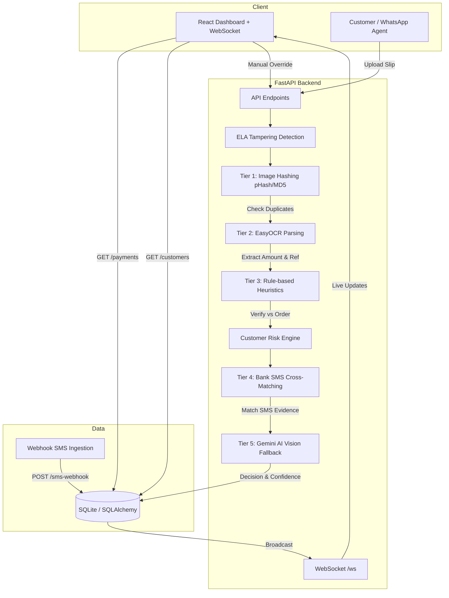

# Automated Bank Payment Verification System

A cost-optimized, multi-tiered AI verification pipeline to automate bank slip verifications, detect fraud, and reduce human workload.

## ✨ Major Features

### 1. ELA Tampering Detection (Photoshop Fraud Detector)
Uses **Error Level Analysis** — a digital forensics technique. When a JPEG is edited, the edited pixels have a different compression level. ELA amplifies this difference and creates a heatmap showing exactly **where** the image was tampered.

- Backend: `compute_ela()` in `pipeline.py` — re-saves at 90% JPEG quality, computes pixel diff, saves heatmap PNG
- Dashboard: Toggle **Original** vs **ELA Heatmap** in the image viewer
- ELA score badge: green = clean, red = suspicious (threshold > 40)

### 2. Customer Risk Score & History Tracking
Tracks every customer's submission history. Repeat fraudsters get a higher **Risk Score** and future submissions are scrutinized more strictly.

- `CustomerRiskProfile` model — risk levels: LOW / MEDIUM / HIGH / BLACKLISTED
- API: `GET /api/v1/customers`, `GET /api/v1/customers/{name}/history`
- Dashboard: **Customer History** panel in sidebar when a payment is selected
- HIGH/BLACKLISTED customers auto-reduce confidence by 0.3

### 3. Real-Time WebSocket Dashboard
Admin dashboard updates **live** when new payments arrive — no manual refresh needed.

- WebSocket endpoint: `ws://localhost:8000/ws`
- Events: `new_payment`, `status_changed`
- Toast notification + sound on new payment
- Slide-in animation for new submissions
- Live status updates on manual override

## 🏗️ Architecture



## 🚀 Setup Instructions

### 1. Backend Setup

```bash
cd backend
python -m venv venv
# Windows
venv\Scripts\activate
# Mac/Linux
source venv/bin/activate

pip install -r requirements.txt
```

Set your Gemini API key in `backend/.env`:
```
GEMINI_API_KEY=your_key_here
```

**Generate Seed Data** (Populates DB and generates 8 test images):
```bash
python seed_data.py
```

**Start the API Server**:
```bash
uvicorn app.main:app --reload --port 8000
```

### 2. Frontend Setup

In a new terminal:
```bash
cd frontend
npm install
npm run dev
```

## 💰 Cost Optimization Strategy

The system relies heavily on local, free verification methods ($0 cost):
- **Perceptual Hashing (pHash)** and MD5 catch duplicates and slightly altered images instantly.
- **EasyOCR** extracts text locally without API calls.
- **Fuzzy Rule Engine** validates data against expectations.
- **Webhook SMS Matcher** boosts confidence using actual bank notifications.

The **Gemini 1.5 Flash Vision API** is used *only* as a fallback when OCR fails or confidence is very low, keeping API costs as close to $0 as possible.

### Gemini API Setup (Optional)

Set the `GEMINI_API_KEY` environment variable — free from [Google AI Studio](https://aistudio.google.com):

```cmd
set GEMINI_API_KEY=your_api_key_here
```

## 🧪 Verification

**Automated:**
```bash
cd backend
python seed_data.py   # Generates 8 test scenarios + ELA heatmaps + risk profiles
```

**Manual:**
1. Start backend + frontend, open dashboard
2. Header shows **Live Updates Active** (WebSocket connected)
3. Submit a new payment → toast notification + auto-appears in list
4. Click a payment → ELA heatmap toggle + Customer History panel
5. High-risk customers show orange/red risk badges

## ⚠️ Limitations & Future Improvements
- **EasyOCR Performance**: Running EasyOCR on a CPU can be slow. In production, this should run on a GPU or be replaced with a faster local model like PaddleOCR or cloud OCR (if budget allows).
- **SQLite Concurrency**: SQLite is used for prototyping. A transition to PostgreSQL is recommended for production.
- **Rule Engine Rigidity**: Currently uses regex for references. Advanced NLP could improve parsing accuracy.
